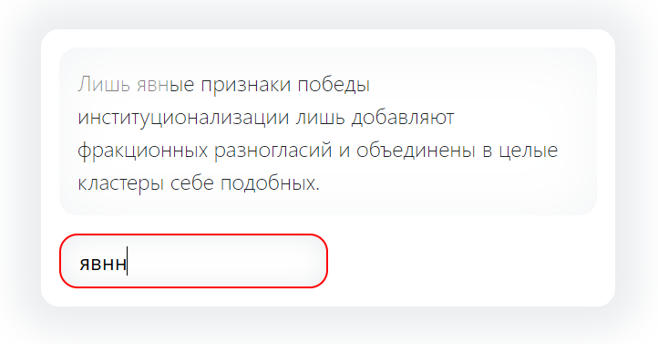
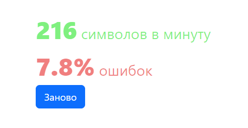

# Тестовое задание - Тренажер слепой печати
- Реализовать Web-приложение “Тренажер слепой печати”.
- Пример референса с удачной реализацией фукционала: https://www.ratatype.ru/typing-test/test/ - ;
- Опубликовать приложение в любой публичный Git-репозиторий (желательно сохранить историю коммитов);
- README-файл в корне проекта с инструкциями по развертыванию.
- Скопировать ссылку в ответном сообщении на данное задание.

Требования к Web-приложению
- получение текста через публичные API (например https://baconipsum.com/json-api/)
- отображение набираемого текста в реальном времени;
- демонстрация скорости печати;
- реакция на ввод неверных символов;
- подсчет точности вводимой информации.

Рекомендуемые технологии:
- React / VueJS;
- По желанию дополнительно использовать Redux/MobX/Vuex;
- Для верстки можно использовать bootstrap;
- Пример API для получения текста https://baconipsum.com/json-api/

- Критерии оценки
- Соответствие ТЗ;
- Качество кода;
- Используемые технологии, арх. решения и т.п.

Бонусные баллы (необязательно)
- Добавление улучшений в описанный функционал приложения (на ваш вкус).

## Как запустить 

```
npm ci
npm start
```

## Немного скриншотов




